# Chat Workflow Graph

This document is the Plan 4 design target for stabilizing the current OpenClass
chat orchestration before moving code out of `chatbot.py`.

It is descriptive, not executable. It does not introduce a workflow framework,
new API shape, new SSE shape, prompt changes, or product behavior changes. The
source of truth remains `AGENTS.md` and the current implementation in
`apps/api/app/services/chatbot.py`.

Audited snapshot for code line references: `main` at
`ccbbb5ea1fe98fe997f5c7fc29dde7388576f92a`. Any line numbers below are
snapshot references for this audit and may drift after later edits.

## Goals

- Make the implicit chat control flow explicit as typed nodes and allowed paths.
- Preserve the current blank-board and existing-board workflow boundaries.
- Give future PRs a strangler migration map: migrate one path at a time, with a
  legacy fallback to `chatbot.py`.
- Keep Chatbot, BoardEditor, FocusResolver, ResourceResolver, requirement
  history, board-task history, and InteractionSession responsibilities separate.

## Current Architecture Inventory

| Layer | Current files | Responsibility |
|---|---|---|
| API / SSE ingress | `apps/api/app/routers/chat.py` | Accept HTTP chat requests, stream observer `field_delta` payloads into visible deltas, translate observer payloads into SSE events, return `ChatResponse`. |
| Service facade | `apps/api/app/services/chat_service.py` | Bind edit metadata and delegate lesson chat to `chatbot.process_chat_on_lesson`. |
| Orchestration | `apps/api/app/services/chatbot.py` | Load context, run gate decisions, resource preflight, active interaction session handling, initial learning, board task flows, legacy direct action fallbacks, persistence, and final response assembly. |
| Turn routing | `chat_turn_gate.py`, `turn_intent.py`, `board_task_decider.py` | Extract rule-based signals, choose the high-level route, and infer document/board task action hints. |
| Existing-board task state | `board_task_manager.py`, `board_task_history.py`, `segment_resolver.py`, `sequence_planner.py` | Maintain `BoardTaskRequirementSheet`, persist versions/events, resolve target focus, handle sequence planning and sequential explanation choices. |
| Initial learning state | `learning_requirement_manager.py`, `learning_requirement_history.py` | Maintain first-level learning requirements, clarification status, freeze snapshots, consume or mark generation failure. |
| Board execution | `board_document_editor.py`, `openai_course_ai.py`, `board_explanation_gate.py` | Generate/edit board documents, make board route decisions, create `BoardExplanationDirective`, gate Chatbot teaching. |
| Resource preflight | `resource_resolver.py`, `resource_library.py` | Rank uploaded resource chapters, prompt for confirmation, extract confirmed reference context. |
| Interaction sessions | `interaction_rules.py` | Start target-bound rule interactions, decide each interaction turn, update session status and metadata. |
| Persistence | workspace store plus history recorders | Save workspaces, lesson commits, frozen requirement versions, board task versions/events, interaction sessions, and commit metadata. |
| Frontend-visible events | `routers/chat.py` stream observer mapping | Preserve `phase`, `requirement_update`, `board_task_update`, `chat_delta`, `document_delta`, `final`, and `error`. |

## Explicit Node Model

### NodeId

`NodeId` is a stable string enum used for traces, tests, and future handler
extraction. It is not a framework name and should not imply a dependency.

| NodeId | Type | Current source |
|---|---|---|
| `INGRESS_HTTP` | ingress | `chat.py` non-stream route |
| `INGRESS_SSE` | ingress | `chat.py` stream route |
| `CHAT_SERVICE_FACADE` | ingress | `chat_service.py` |
| `CONTEXT_LOAD` | context | `_chat_response` workspace/package/lesson load |
| `TURN_CONTEXT_BUILD` | context | `_chat_response` derived context, selection, document state |
| `BOARD_ACTION_DECIDE` | decision | `_board_task_action_decision` / `board_task_decider.py` |
| `CHAT_TURN_GATE` | decision | `decide_chat_turn` |
| `RESOURCE_PREFLIGHT` | decision | `resolve_resource_reference` |
| `ACTIVE_INTERACTION_CHECK` | decision | `_handle_existing_interaction_session` call site |
| `LEGACY_COMPATIBILITY_DISPATCH` | decision | current direct action compatibility branches |
| `RESPONSE_ASSEMBLE` | terminal | `_response` |
| `STREAM_EVENT_EMIT` | terminal | `_chat_stream_events` observer mapping |
| `INTERACTION_SEQUENCE_CHECK` | interaction | `_handle_section_explanation_sequence_turn` |
| `INTERACTION_DECIDE` | interaction | `decide_interaction_turn` |
| `INTERACTION_CONTINUE` | interaction | `continue_rule` / `resume_rule` handling |
| `INTERACTION_RULE_VIOLATION` | interaction | `rule_violation` handling |
| `INTERACTION_EXIT` | interaction | `exit_rule` handling |
| `INTERACTION_NEW_TASK` | interaction | `new_task` / `side_learning_request` re-entry |
| `INTERACTION_START_RESOLVE` | interaction | `build_interaction_start` focus resolution |
| `INTERACTION_START_PERSIST` | interaction | save active session and source metadata |
| `INTERACTION_TERMINAL` | terminal | interaction response returned |
| `INITIAL_MODE_DECIDE` | initial_learning | `generate_initial_learning_work_mode` |
| `INITIAL_UNKNOWN_GUIDANCE` | initial_learning | unknown mode guidance response |
| `INITIAL_NARROW_TOPIC` | initial_learning | narrow-topic response |
| `INITIAL_REQUIREMENT_COLLECT` | initial_learning | `update_learning_requirements_from_chat` |
| `INITIAL_REQUIREMENT_READY` | initial_learning | `LearningClarificationStatus.ready_for_board` |
| `INITIAL_REQUIREMENT_FREEZE` | initial_learning | `LearningRequirementHistoryRecorder.freeze` |
| `INITIAL_BOARD_GENERATE` | board_execution | `BoardDocumentEditor.generate_from_requirements` |
| `INITIAL_GENERATION_FAILED` | failure | `requirement_history.generation_failed` |
| `INITIAL_BOARD_COMMIT` | persistence | lesson commit plus requirement consume |
| `RESOURCE_REFERENCE_PROMPT` | resource | `ResourceReferencePrompt` response |
| `RESOURCE_CONFIRMED_GENERATE` | resource | `_generate_board_from_confirmed_resource` |
| `BOARD_TASK_COLLECT` | board_task | `update_board_task_from_chat` |
| `BOARD_TASK_CLARIFY_FIELDS` | board_task | incomplete board task response |
| `BOARD_TASK_READY_PERSIST` | persistence | ready board task version |
| `BOARD_TARGET_RESOLVE` | focus | `resolve_board_focus` / selection / whole-document focus |
| `BOARD_ROUTE_DECIDE` | decision | `generate_board_task_route_decision` or local route |
| `BOARD_ROUTE_CLARIFY_LOCATION` | board_task | location clarification response |
| `BOARD_AWAIT_WRITE_CONFIRMATION` | board_task | content-absent write confirmation |
| `BOARD_WRITE_CONFIRMATION_HANDLE` | board_task | confirm or decline awaiting write |
| `BOARD_WRITE_EXECUTE` | board_execution | `_execute_board_task_write` |
| `BOARD_EDIT_EXECUTE` | board_execution | edit branch in `_handle_existing_board_task_flow` |
| `BOARD_EXPLAIN_DIRECTIVE` | board_execution | `generate_board_directed_explanation_message` |
| `BOARD_EXPLAIN_COMMIT` | persistence | chat commit with directive metadata |
| `BOARD_CHAT_ROUTE` | board_task | route `chat` into interaction start |
| `BOARD_SEQUENCE_PLAN` | board_task | `plan_explanation_sequence` |
| `BOARD_SEQUENCE_START` | interaction | `_start_section_explanation_sequence` |
| `BOARD_TASK_FAILURE` | failure | board task `execution_failed` / `not_executed` |
| `ORDINARY_CHAT_GENERATE` | ordinary_chat | ordinary Chatbot reply |
| `REQUIREMENT_CHAT_UPDATE` | initial_learning | free chat plus requirement update |
| `LEGACY_TEACHING_ACTION` | compatibility | `teaching_action in {"continue", "restart"}` |
| `LEGACY_DIRECT_EDIT_ACTION` | compatibility | `interaction_mode == "direct_edit"` branch |
| `LEGACY_DOCUMENT_ACTION` | compatibility | old `DOCUMENT_WRITE_ACTIONS` / `explain_target` branch |
| `LEGACY_FALLBACK_EXPLAIN` | compatibility | fallback board-directed explanation branch |
| `PERSIST_CHAT_COMMIT` | persistence | chat-only commit |
| `PERSIST_BOARD_COMMIT` | persistence | board-generation or board-edit commit |
| `TERMINAL_SUCCESS` | terminal | successful final response |
| `TERMINAL_CLARIFY` | terminal | clarification / awaiting user input |
| `TERMINAL_ERROR` | terminal | exception or stream error response |

Current documented NodeId count: 59.

### NodeId Coverage

This table classifies every NodeId above so future migrations can tell graph
nodes from compatibility shims and reserved mapping labels.

| Coverage | Count | NodeIds |
|---|---:|---|
| Used in target graph | 48 | `INGRESS_HTTP`, `INGRESS_SSE`, `CHAT_SERVICE_FACADE`, `CONTEXT_LOAD`, `TURN_CONTEXT_BUILD`, `BOARD_ACTION_DECIDE`, `CHAT_TURN_GATE`, `RESOURCE_PREFLIGHT`, `ACTIVE_INTERACTION_CHECK`, `RESPONSE_ASSEMBLE`, `STREAM_EVENT_EMIT`, `INTERACTION_SEQUENCE_CHECK`, `INTERACTION_DECIDE`, `INTERACTION_CONTINUE`, `INTERACTION_RULE_VIOLATION`, `INTERACTION_EXIT`, `INTERACTION_NEW_TASK`, `INTERACTION_START_RESOLVE`, `INTERACTION_START_PERSIST`, `INITIAL_MODE_DECIDE`, `INITIAL_UNKNOWN_GUIDANCE`, `INITIAL_NARROW_TOPIC`, `INITIAL_REQUIREMENT_COLLECT`, `INITIAL_REQUIREMENT_READY`, `INITIAL_REQUIREMENT_FREEZE`, `INITIAL_BOARD_GENERATE`, `INITIAL_GENERATION_FAILED`, `INITIAL_BOARD_COMMIT`, `RESOURCE_REFERENCE_PROMPT`, `RESOURCE_CONFIRMED_GENERATE`, `BOARD_TASK_COLLECT`, `BOARD_TASK_CLARIFY_FIELDS`, `BOARD_TASK_READY_PERSIST`, `BOARD_TARGET_RESOLVE`, `BOARD_ROUTE_DECIDE`, `BOARD_ROUTE_CLARIFY_LOCATION`, `BOARD_AWAIT_WRITE_CONFIRMATION`, `BOARD_WRITE_EXECUTE`, `BOARD_EDIT_EXECUTE`, `BOARD_EXPLAIN_DIRECTIVE`, `BOARD_EXPLAIN_COMMIT`, `BOARD_CHAT_ROUTE`, `BOARD_SEQUENCE_PLAN`, `BOARD_SEQUENCE_START`, `ORDINARY_CHAT_GENERATE`, `REQUIREMENT_CHAT_UPDATE`, `PERSIST_CHAT_COMMIT`, `PERSIST_BOARD_COMMIT` |
| Compatibility-only, still shown in graph | 5 | `LEGACY_COMPATIBILITY_DISPATCH`, `LEGACY_TEACHING_ACTION`, `LEGACY_DIRECT_EDIT_ACTION`, `LEGACY_DOCUMENT_ACTION`, `LEGACY_FALLBACK_EXPLAIN` |
| Reserved / mapping-only, not in target graph | 6 | `INTERACTION_TERMINAL`, `BOARD_WRITE_CONFIRMATION_HANDLE`, `BOARD_TASK_FAILURE`, `TERMINAL_SUCCESS`, `TERMINAL_CLARIFY`, `TERMINAL_ERROR` |

No NodeId is intentionally left unclassified.

### Request Context And Workflow State

Future handlers should separate immutable request/context inputs from evolving
workflow state. `CONTEXT_LOAD` and `TURN_CONTEXT_BUILD` may construct the
immutable input object, but they must not pretend post-decision fields already
exist before decision nodes run.

```python
@dataclass(frozen=True)
class ChatTurnRequestContext:
    workspace: Workspace
    package: CoursePackage
    lesson: Lesson
    request: ChatRequest
    visible_package: CoursePackage
    document_empty: bool
    selection_excerpt: str | None
    requirement_history: LearningRequirementHistoryRecorder
    board_task_history: BoardTaskHistoryRecorder


@dataclass(frozen=True)
class ChatWorkflowState:
    request_context: ChatTurnRequestContext
    action_type: BoardTaskAction | None = None
    board_action_decision: BoardTaskActionDecision | None = None
    turn_decision: ChatTurnGateDecision | None = None
    resource_resolution: ResourceResolution | None = None
    selected_reference: ResourceReferenceContext | None = None
    resolved_focus: BoardFocusRef | None = None
    focus_candidates: tuple[BoardFocusRef, ...] = ()
```

`ChatWorkflowState` is still treated as an immutable value: a node returns a new
state when it adds `board_action_decision`, `turn_decision`,
`resource_resolution`, or other post-decision data. The trace is collected in a
separate `WorkflowTrace`, not as a mutable list inside a frozen dataclass.

```python
@dataclass(frozen=True)
class WorkflowTrace:
    steps: tuple[WorkflowStepTrace, ...] = ()
```

### NodeResult

Each node may continue, return a terminal outcome payload, or return a failure
payload. Only `RESPONSE_ASSEMBLE` may construct the final `ChatResponse`.

```python
@dataclass(frozen=True)
class Continue:
    state: ChatWorkflowState
    next_node: NodeId
    step: WorkflowStepTrace

@dataclass(frozen=True)
class TerminalPayload:
    outcome: TerminalOutcome
    payload: Mapping[str, object]
    next_node: Literal["RESPONSE_ASSEMBLE"] = "RESPONSE_ASSEMBLE"

@dataclass(frozen=True)
class Failure:
    outcome: TerminalOutcome
    payload: Mapping[str, object]
    retryable: bool
    next_node: Literal["RESPONSE_ASSEMBLE"] = "RESPONSE_ASSEMBLE"
```

### WorkflowStepTrace

Trace entries should be persisted or attached to metadata only after the
corresponding current code path already persists comparable information. The
first implementation can keep this in memory and expose it only in tests.

```python
@dataclass(frozen=True)
class WorkflowStepTrace:
    node_id: NodeId
    entered_at: str
    decision: str | None
    reason: str | None
    run_id: str | None
    version_id: str | None
    commit_id: str | None
```

### Allowed Side Effects

| Node type | Allowed side effects |
|---|---|
| `ingress` | Parse request, bind stream observer, translate exceptions into `error` SSE. |
| `context` | Read workspace/package/lesson state, derive immutable turn context. No writes. |
| `decision` | Pure or model-backed decision. No workspace writes unless current code already records an explicit history event in the same path. |
| `resource` | Rank resources and build reference prompt or selected reference context. No document writes. |
| `initial_learning` | Write learning requirement versions/events only through `LearningRequirementHistoryRecorder`. |
| `board_task` | Write board task versions/events only through `BoardTaskHistoryRecorder`; never edit the board directly. |
| `focus` | Resolve target focus or candidates. No document writes. |
| `interaction` | Start, update, pause, or clear `active_interaction_session`; consume linked board task only when the session starts successfully. |
| `board_execution` | Call BoardEditor or BoardExplanationDirective generation. Board document writes require a later commit node. |
| `persistence` | Save workspace, create lesson commit, consume runs, mark failure/not-executed. |
| `terminal` | Assemble `ChatResponse` and emit final/error events. No new business decisions. |
| `compatibility` | Preserve current behavior while routing toward canonical nodes where possible. Must not gain new product behavior. |
| `failure` | Record `generation_failed`, `execution_failed`, or `not_executed` according to the active run type. |

## Current `_chat_response` Dispatch Precedence

This is the current audited order in `chatbot.py` at
`ccbbb5ea1fe98fe997f5c7fc29dde7388576f92a`. The first trace PR must instrument
this actual precedence before any code tries to normalize or reorder it.

1. Load workspace, package, lesson, visible package, selection, document state,
   requirement history, and board task history.
2. Run board action hinting through `_board_task_action_decision`.
3. Run `decide_chat_turn` and derive the preferred `action_type`.
4. Run `resolve_resource_reference` and merge confirmed reference excerpts with
   any selection excerpt.
5. Give an active `InteractionSession` first chance to handle the turn.
6. If the gate says existing-board task, or forced explain applies, try
   `_handle_existing_board_task_flow`.
7. If the board is blank and initial learning applies, try
   `_handle_initial_learning_work_mode`.
8. Handle explicit `board_generation_action == "start"`.
9. Handle legacy `teaching_action in {"continue", "restart"}`.
10. Handle legacy `interaction_mode == "direct_edit"`.
11. Handle legacy document actions from `DOCUMENT_WRITE_ACTIONS` and
    `explain_target`.
12. Handle explicit generation / document artifact requests through the
    first-level requirement path.
13. Prompt for resource reference when resource preflight found a candidate.
14. Handle confirmed resource generation.
15. Handle fallback board-directed explanation for existing boards.
16. Handle pure ordinary chat when the gate selects `ordinary_chat`.
17. Fall back to free chat plus requirement update and possible ready-board
    generation.

This order contains compatibility behavior and is not the final target shape.
It is still the behavior-preserving order that trace instrumentation must
observe first.

## Target Canonical Workflow

The target graph below is the canonical design for future extractions, not a
claim that current code already follows this exact structure. The migration
rule is: observe current dispatch first, then move one current path at a time
behind the corresponding canonical NodeId.

Canonical order:

1. Ingress and service facade load immutable request context.
2. Decision nodes add evolving workflow state in order:
   `BOARD_ACTION_DECIDE -> CHAT_TURN_GATE -> RESOURCE_PREFLIGHT`.
3. Active interaction session gets first canonical handling, because it owns an
   already-started rule-bound conversation.
4. Existing-board requests enter `BOARD_TASK_COLLECT`, then target resolution,
   route decision, execution, and persistence.
5. Blank-board learning requests enter initial learning, requirement freeze,
   board generation, and requirement consumption.
6. Resource reference stays a preflight or confirmed-generation path and must not
   bypass requirement freeze/history.
7. Ordinary chat remains the no-board-write, no-run-consume path.
8. Compatibility nodes remain visible until tests prove their current behavior
   has moved into canonical paths.

## Full Workflow Graph

```mermaid
flowchart TD
  HTTP["INGRESS_HTTP"] --> FACADE["CHAT_SERVICE_FACADE"]
  SSE["INGRESS_SSE"] --> FACADE
  FACADE --> LOAD["CONTEXT_LOAD"]
  LOAD --> BUILD["TURN_CONTEXT_BUILD"]
  BUILD --> ACTION["BOARD_ACTION_DECIDE"]
  ACTION --> GATE["CHAT_TURN_GATE"]
  GATE --> RESOURCE["RESOURCE_PREFLIGHT"]
  RESOURCE --> INTERACTION_CHECK["ACTIVE_INTERACTION_CHECK"]

  INTERACTION_CHECK -->|active session| SEQ_CHECK["INTERACTION_SEQUENCE_CHECK"]
  SEQ_CHECK -->|sequence handled| RESPONSE["RESPONSE_ASSEMBLE"]
  SEQ_CHECK -->|not sequence| IDECIDE["INTERACTION_DECIDE"]
  IDECIDE -->|continue_rule or resume_rule| ICONTINUE["INTERACTION_CONTINUE"]
  IDECIDE -->|rule_violation| IVIOLATION["INTERACTION_RULE_VIOLATION"]
  IDECIDE -->|exit_rule| IEXIT["INTERACTION_EXIT"]
  IDECIDE -->|new_task or side_learning_request| INEWTASK["INTERACTION_NEW_TASK"]
  ICONTINUE --> PCHAT["PERSIST_CHAT_COMMIT"]
  IVIOLATION --> PCHAT
  IEXIT --> PCHAT
  INEWTASK --> BOARD_COLLECT["BOARD_TASK_COLLECT"]

  INTERACTION_CHECK -->|no terminal interaction| BOARD_ENTRY["BOARD_TASK_COLLECT"]
  BOARD_ENTRY -->|not existing-board task| INITIAL_CHECK["INITIAL_MODE_DECIDE"]
  BOARD_ENTRY -->|missing fields| BOARD_CLARIFY["BOARD_TASK_CLARIFY_FIELDS"]
  BOARD_ENTRY -->|ready| BOARD_READY["BOARD_TASK_READY_PERSIST"]
  BOARD_READY --> TARGET["BOARD_TARGET_RESOLVE"]
  TARGET --> ROUTE["BOARD_ROUTE_DECIDE"]
  ROUTE -->|clarify_location| LOC_CLARIFY["BOARD_ROUTE_CLARIFY_LOCATION"]
  ROUTE -->|await_write_confirmation| AWAIT_WRITE["BOARD_AWAIT_WRITE_CONFIRMATION"]
  ROUTE -->|write| WRITE["BOARD_WRITE_EXECUTE"]
  ROUTE -->|edit| EDIT["BOARD_EDIT_EXECUTE"]
  ROUTE -->|explain| SEQ_PLAN["BOARD_SEQUENCE_PLAN"]
  SEQ_PLAN -->|sequence| SEQ_START["BOARD_SEQUENCE_START"]
  SEQ_PLAN -->|single target| EXPLAIN["BOARD_EXPLAIN_DIRECTIVE"]
  ROUTE -->|chat| CHAT_ROUTE["BOARD_CHAT_ROUTE"]
  CHAT_ROUTE --> ISTART_RESOLVE["INTERACTION_START_RESOLVE"]
  ISTART_RESOLVE --> ISTART_PERSIST["INTERACTION_START_PERSIST"]

  WRITE --> PBOARD["PERSIST_BOARD_COMMIT"]
  EDIT --> PBOARD
  EXPLAIN --> EXPLAIN_COMMIT["BOARD_EXPLAIN_COMMIT"]
  EXPLAIN_COMMIT --> PCHAT
  SEQ_START --> PCHAT
  BOARD_CLARIFY --> RESPONSE
  LOC_CLARIFY --> RESPONSE
  AWAIT_WRITE --> RESPONSE
  ISTART_PERSIST --> RESPONSE

  INITIAL_CHECK -->|knowledge_board| IFREEZE["INITIAL_REQUIREMENT_FREEZE"]
  INITIAL_CHECK -->|narrow_topic| INARROW["INITIAL_NARROW_TOPIC"]
  INITIAL_CHECK -->|unknown| IUNKNOWN["INITIAL_UNKNOWN_GUIDANCE"]
  INITIAL_CHECK -->|practice or none| IREQ["INITIAL_REQUIREMENT_COLLECT"]
  IREQ --> IREADY["INITIAL_REQUIREMENT_READY"]
  IREADY -->|not ready| REQUIREMENT_CHAT["REQUIREMENT_CHAT_UPDATE"]
  IREADY -->|ready| IFREEZE
  IFREEZE --> IGENERATE["INITIAL_BOARD_GENERATE"]
  IGENERATE -->|success| ICOMMIT["INITIAL_BOARD_COMMIT"]
  IGENERATE -->|failed| IFAILED["INITIAL_GENERATION_FAILED"]

  RESOURCE -->|prompt| RPROMPT["RESOURCE_REFERENCE_PROMPT"]
  RESOURCE -->|confirmed generate| RGENERATE["RESOURCE_CONFIRMED_GENERATE"]
  RGENERATE --> IGENERATE

  INITIAL_CHECK -->|ordinary| ORDINARY["ORDINARY_CHAT_GENERATE"]
  INITIAL_CHECK --> COMPAT["LEGACY_COMPATIBILITY_DISPATCH"]
  COMPAT --> LTEACH["LEGACY_TEACHING_ACTION"]
  COMPAT --> LDIRECT["LEGACY_DIRECT_EDIT_ACTION"]
  COMPAT --> LDOC["LEGACY_DOCUMENT_ACTION"]
  COMPAT --> LFALLBACK["LEGACY_FALLBACK_EXPLAIN"]
  LTEACH --> PCHAT
  LDIRECT --> PBOARD
  LDOC --> PBOARD
  LFALLBACK --> PCHAT
  ORDINARY --> PCHAT
  REQUIREMENT_CHAT --> PCHAT
  IUNKNOWN --> PCHAT
  INARROW --> PCHAT
  ICOMMIT --> PBOARD
  IFAILED --> RESPONSE
  PCHAT --> RESPONSE
  PBOARD --> RESPONSE
  RPROMPT --> RESPONSE
  RESPONSE --> FINAL["STREAM_EVENT_EMIT / final"]
  RESPONSE --> ERROR["STREAM_EVENT_EMIT / error"]
```



## Path Specifications

### `ordinary_chat`

1. `CONTEXT_LOAD`
2. `TURN_CONTEXT_BUILD`
3. `BOARD_ACTION_DECIDE`
4. `CHAT_TURN_GATE`
5. `RESOURCE_PREFLIGHT`
6. `ACTIVE_INTERACTION_CHECK`
7. `ORDINARY_CHAT_GENERATE`
8. `PERSIST_CHAT_COMMIT`
9. `RESPONSE_ASSEMBLE`

No requirement run or board task run may be created for pure ordinary chat.

### `initial_learning`

1. `INITIAL_MODE_DECIDE`
2. `INITIAL_REQUIREMENT_COLLECT`
3. `INITIAL_REQUIREMENT_READY`
4. If not ready: `REQUIREMENT_CHAT_UPDATE -> PERSIST_CHAT_COMMIT`.
5. If ready: `INITIAL_REQUIREMENT_FREEZE -> INITIAL_BOARD_GENERATE`.

This path applies only when `board_document` is empty.

### `initial_board_generation`

1. `INITIAL_REQUIREMENT_FREEZE`
2. `INITIAL_BOARD_GENERATE`
3. On success: `INITIAL_BOARD_COMMIT`, then consume requirement run.
4. On failure: `INITIAL_GENERATION_FAILED`, keep the frozen run retryable.

BoardEditor must receive the frozen requirement payload, not raw chat history.

### `resource_reference`

1. `RESOURCE_PREFLIGHT`
2. If a prompt is needed: `RESOURCE_REFERENCE_PROMPT`.
3. If the user confirms a reference and generation is requested:
   `RESOURCE_CONFIRMED_GENERATE -> INITIAL_REQUIREMENT_FREEZE -> INITIAL_BOARD_GENERATE`.
4. If the user skips: continue without selected reference.

Resource evidence must be explicitly selected before it can affect generation or
Chatbot context.

### `existing_board write`

1. `BOARD_TASK_COLLECT`
2. `BOARD_TASK_READY_PERSIST`
3. `BOARD_TARGET_RESOLVE`
4. `BOARD_ROUTE_DECIDE`
5. If content is absent and confirmation is required:
   `BOARD_AWAIT_WRITE_CONFIRMATION`.
6. If confirmed or target is valid:
   `BOARD_WRITE_EXECUTE -> PERSIST_BOARD_COMMIT`.
7. On success, consume the board task run.
8. On failure, record `execution_failed` and keep the run active for retry.

### `existing_board edit`

1. `BOARD_TASK_COLLECT`
2. `BOARD_TASK_READY_PERSIST`
3. `BOARD_TARGET_RESOLVE`
4. `BOARD_ROUTE_DECIDE`
5. `BOARD_EDIT_EXECUTE`
6. On success: commit board edit, consume board task.
7. On failure: record `execution_failed`; do not silently clear the task.

### `existing_board explain`

1. `BOARD_TASK_COLLECT`
2. `BOARD_TASK_READY_PERSIST`
3. `BOARD_TARGET_RESOLVE`
4. `BOARD_ROUTE_DECIDE`
5. `BOARD_SEQUENCE_PLAN`
6. If sequential: `BOARD_SEQUENCE_START`.
7. If single target: `BOARD_EXPLAIN_DIRECTIVE -> BOARD_EXPLAIN_COMMIT`.

Chatbot may explain only from `BoardExplanationDirective` output and the target
excerpt/directive context handed over by Board AI.

### `existing_board chat`

1. `BOARD_TASK_COLLECT`
2. `BOARD_TASK_READY_PERSIST`
3. `BOARD_TARGET_RESOLVE`
4. `BOARD_ROUTE_DECIDE`
5. `BOARD_CHAT_ROUTE`
6. `INTERACTION_START_RESOLVE`
7. `INTERACTION_START_PERSIST`
8. Consume the linked board task only after session start succeeds.

### `interaction continue_rule`

1. `ACTIVE_INTERACTION_CHECK`
2. `INTERACTION_SEQUENCE_CHECK`
3. `INTERACTION_DECIDE`
4. `INTERACTION_CONTINUE`
5. Persist updated session and chat commit.

### `interaction rule_violation`

1. `INTERACTION_DECIDE`
2. `INTERACTION_RULE_VIOLATION`
3. Persist session progress and a rule-bound correction response.

The session remains active.

### `interaction exit_rule`

1. `INTERACTION_DECIDE`
2. `INTERACTION_EXIT`
3. Clear or end the active session.
4. Persist a chat commit describing the exit.

### `interaction new_task`

1. `INTERACTION_DECIDE`
2. `INTERACTION_NEW_TASK`
3. End the current session.
4. Re-enter `BOARD_TASK_COLLECT` with the current user message.

This includes the current `side_learning_request` compatibility behavior.

### `failure / retry`

| Failure source | Required behavior |
|---|---|
| Initial board generation failed | Record `generation_failed`; keep frozen requirement run retryable. |
| Board write/edit/explain failed | Record `execution_failed`; keep active board task unless code intentionally marks not executed. |
| User declines content-absent write | Record `not_executed`; clear active board task. |
| Ambiguous focus | Return clarification; keep collecting or ready task active. |
| Stream exception | Emit `error` SSE with trace id; do not fake a successful final response. |

## Allowed Edge Table

| From | To | Condition |
|---|---|---|
| `INGRESS_HTTP` | `CHAT_SERVICE_FACADE` | Non-stream request. |
| `INGRESS_SSE` | `CHAT_SERVICE_FACADE` | Stream request. |
| `CHAT_SERVICE_FACADE` | `CONTEXT_LOAD` | Chat service delegates to lesson chat. |
| `CONTEXT_LOAD` | `TURN_CONTEXT_BUILD` | Workspace, package, and lesson are loaded. |
| `TURN_CONTEXT_BUILD` | `BOARD_ACTION_DECIDE` | Selection, board state, and request controls are known. |
| `BOARD_ACTION_DECIDE` | `CHAT_TURN_GATE` | Action hints are available. |
| `CHAT_TURN_GATE` | `RESOURCE_PREFLIGHT` | High-level route is known. |
| `RESOURCE_PREFLIGHT` | `RESOURCE_REFERENCE_PROMPT` | Resource match requires user confirmation. |
| `RESOURCE_PREFLIGHT` | `ACTIVE_INTERACTION_CHECK` | No blocking resource prompt. |
| `ACTIVE_INTERACTION_CHECK` | `INTERACTION_SEQUENCE_CHECK` | Active session exists. |
| `INTERACTION_SEQUENCE_CHECK` | `INTERACTION_DECIDE` | Active session is not a handled sequence turn. |
| `INTERACTION_DECIDE` | `INTERACTION_CONTINUE` | Decision route is `continue_rule` or `resume_rule`. |
| `INTERACTION_DECIDE` | `INTERACTION_RULE_VIOLATION` | Decision route is `rule_violation`. |
| `INTERACTION_DECIDE` | `INTERACTION_EXIT` | Decision route is `exit_rule`. |
| `INTERACTION_DECIDE` | `INTERACTION_NEW_TASK` | Decision route is `new_task` or `side_learning_request`. |
| `INTERACTION_NEW_TASK` | `BOARD_TASK_COLLECT` | User message should be reprocessed as a board task. |
| `ACTIVE_INTERACTION_CHECK` | `BOARD_TASK_COLLECT` | No active interaction terminal handled the turn. |
| `BOARD_TASK_COLLECT` | `BOARD_TASK_CLARIFY_FIELDS` | Board task four-field sheet is incomplete. |
| `BOARD_TASK_COLLECT` | `BOARD_TASK_READY_PERSIST` | Board task sheet is complete. |
| `BOARD_TASK_READY_PERSIST` | `BOARD_TARGET_RESOLVE` | Ready version persisted. |
| `BOARD_TARGET_RESOLVE` | `BOARD_ROUTE_DECIDE` | Focus result or focus candidates are available. |
| `BOARD_ROUTE_DECIDE` | `BOARD_ROUTE_CLARIFY_LOCATION` | Route is `clarify_location`. |
| `BOARD_ROUTE_DECIDE` | `BOARD_AWAIT_WRITE_CONFIRMATION` | Route is `await_write_confirmation`. |
| `BOARD_ROUTE_DECIDE` | `BOARD_WRITE_EXECUTE` | Route is `write`. |
| `BOARD_ROUTE_DECIDE` | `BOARD_EDIT_EXECUTE` | Route is `edit`. |
| `BOARD_ROUTE_DECIDE` | `BOARD_SEQUENCE_PLAN` | Route is `explain`. |
| `BOARD_SEQUENCE_PLAN` | `BOARD_SEQUENCE_START` | Sequence plan exists. |
| `BOARD_SEQUENCE_PLAN` | `BOARD_EXPLAIN_DIRECTIVE` | Single target explanation. |
| `BOARD_ROUTE_DECIDE` | `BOARD_CHAT_ROUTE` | Route is `chat`. |
| `BOARD_CHAT_ROUTE` | `INTERACTION_START_RESOLVE` | Interaction rule draft should start. |
| `INTERACTION_START_RESOLVE` | `INTERACTION_START_PERSIST` | Focus and rule allow session start. |
| `INITIAL_MODE_DECIDE` | `INITIAL_UNKNOWN_GUIDANCE` | Work mode is `unknown`. |
| `INITIAL_MODE_DECIDE` | `INITIAL_NARROW_TOPIC` | Work mode is `narrow_topic`. |
| `INITIAL_MODE_DECIDE` | `INITIAL_REQUIREMENT_FREEZE` | Work mode is ready `knowledge_board`. |
| `INITIAL_MODE_DECIDE` | `INITIAL_REQUIREMENT_COLLECT` | Practice artifact or regular requirement path. |
| `INITIAL_REQUIREMENT_COLLECT` | `INITIAL_REQUIREMENT_READY` | Requirement status computed. |
| `INITIAL_REQUIREMENT_READY` | `REQUIREMENT_CHAT_UPDATE` | Not ready for board. |
| `INITIAL_REQUIREMENT_READY` | `INITIAL_REQUIREMENT_FREEZE` | Ready or forced to generate. |
| `INITIAL_REQUIREMENT_FREEZE` | `INITIAL_BOARD_GENERATE` | Frozen version persisted. |
| `INITIAL_BOARD_GENERATE` | `INITIAL_BOARD_COMMIT` | Board generation changed document. |
| `INITIAL_BOARD_GENERATE` | `INITIAL_GENERATION_FAILED` | Board generation failed or no changed document. |
| `LEGACY_COMPATIBILITY_DISPATCH` | `LEGACY_TEACHING_ACTION` | `teaching_action` compatibility request. |
| `LEGACY_COMPATIBILITY_DISPATCH` | `LEGACY_DIRECT_EDIT_ACTION` | `interaction_mode == "direct_edit"` compatibility request. |
| `LEGACY_COMPATIBILITY_DISPATCH` | `LEGACY_DOCUMENT_ACTION` | Old document action branch still handles the turn. |
| `LEGACY_COMPATIBILITY_DISPATCH` | `LEGACY_FALLBACK_EXPLAIN` | Existing board fallback explanation branch. |
| Any commit node | `RESPONSE_ASSEMBLE` | ChatResponse can be built. |
| `RESPONSE_ASSEMBLE` | `STREAM_EVENT_EMIT` | Stream route maps final response to SSE. |
| Any node | `TERMINAL_ERROR` | Unhandled exception or explicit error terminal. |

## State Transition Table

| State or event | Owner | Entered when | Allowed next states |
|---|---|---|---|
| `collecting` | learning requirement | Initial requirement exists but is not ready. | `ready`, `frozen`, `archived` |
| `collecting` | board task | Existing-board task sheet is incomplete. | `ready`, `awaiting_confirmation`, `not_executed`, `archived` |
| `ready` | learning requirement | Requirement is complete enough for board generation. | `frozen`, `archived` |
| `ready` | board task | Four-field task sheet is complete and can resolve/route. | `awaiting_confirmation`, `consumed`, `not_executed`, `execution_failed` event |
| `frozen` | learning requirement | Frozen snapshot has been persisted before BoardEditor execution. | `consumed`, `generation_failed` event |
| `awaiting_confirmation` | board task | Board lacks content and user must confirm write. | `ready`, `consumed`, `not_executed`, `execution_failed` event |
| `consumed` | learning requirement | Board generation succeeded and commit metadata links the run. | terminal |
| `consumed` | board task | Write/edit/explain/chat succeeded and commit/session metadata links the run. | terminal |
| `not_executed` | board task | User declines, cancels, or old edit task is converted into a new write confirmation task. | terminal |
| `execution_failed` | board task event | Board task execution failed. Current run should remain retryable unless explicitly finished. | active status remains `ready` or `awaiting_confirmation` |
| `generation_failed` | learning requirement event | Board generation failed. Frozen run remains available for retry. | active status remains `frozen` |

`execution_failed` and `generation_failed` are currently history events rather
than stored run status literals. The workflow graph treats them as failure
outcomes that must be visible and retry-aware.

## Compatibility Inventory

Post-Wave8 audit refresh base: `main` at
`738b378aff760d27e38a6130254f2a6a0e73b99b`.
Evidence-only prep branch:
`codex/prep/compatibility-drift-guard-wave8-c413` at
`9efc4110182c6976e14e9e2617356d009372d894`.

| Current behavior | Decision | Evidence boundary | Future decision |
|---|---|---|---|
| `teaching_action` | Keep. | Public `ChatRequest` compatibility control still has frontend callers and preserves section teaching progress through board-side directive gating. | Remove only after equivalent section teaching is modeled through canonical board-task or interaction paths with parity tests. |
| `direct_edit` | Keep. | The composer, selection popover, API compatibility mode, document edit facade, and board-task decider still use `interaction_mode == "direct_edit"`. | Migrate through `BoardTaskRequirementSheet` plus target resolution after write/edit tests cover selection, focus failure, and operation metadata. |
| `board_generation_action=start` | Keep. | Explicit user control already maps to initial generation on blank boards and existing-board task flow on non-empty boards. | Keep as a canonical control; it is not part of legacy cleanup. |
| Sequential explanation | Keep. | Sequence planning is already represented as `BOARD_SEQUENCE_PLAN -> BOARD_SEQUENCE_START -> INTERACTION_SEQUENCE_CHECK`. | Preserve current node order and tests during later handler work. |
| Recent focus inheritance | Keep. | Recent edit/write focus helpers reuse generic commit metadata as a target-location hint. | Move the policy under `BOARD_TARGET_RESOLVE` later; do not keep it as a top-level route forever. |
| Autonomous location choice | Keep guarded. | Current behavior is generic target-resolution policy, not a subject-specific rule. | Model as deterministic `BOARD_TARGET_RESOLVE` behavior with ambiguity tests before cleanup. |
| Legacy append/edit/explain fallback (`DOCUMENT_WRITE_ACTIONS` / `EDIT_ACTIONS` / `explain_target`) | Deprecate; keep guarded. | The old direct action handler still covers append/edit/explain fallbacks outside the canonical board-task terminal modules. | Do not expand. Remove one action at a time only after canonical write/edit/explain/chat paths and commit metadata tests cover parity. |
| Resource-confirmed board generation | Keep. | Wave8 activated the trace contract around resource preflight, frozen requirement generation, success commit, consume, save, and failure retryability. | Keep as resource preflight plus frozen requirement generation; extraction remains separate from compatibility cleanup. |
| Fallback board-directed explanation | Deprecate; keep guarded. | The late explanation fallback still routes through `BoardExplanationDirective`, but it is not the preferred second-layer board-task path. | Remove after existing-board explain fallback cases route through `BOARD_TASK_COLLECT` and the canonical explain path. |
| Private compatibility aliases | Keep; no new usage. | Private aliases keep extracted handlers, service facades, and focused tests compatible while migration continues. | Replace with public dependency builders or module-local helpers as handlers graduate; new code should not add alias usage. |

The broad AST drift guard from `9efc411` is intentionally not promoted here.
It freezes too many pending surfaces while canonical explain, edit, chat, and
generation paths are still landing. A later guard should be narrower and should
arrive in the same cleanup PR that supplies replacement parity tests.

## Persistence Invariants

### Persist Before AI Execution

- Requirement generation path: persist a ready/frozen requirement version before
  calling BoardEditor.
- Resource-confirmed generation: persist the frozen requirement snapshot with
  selected reference metadata before calling BoardEditor.
- Existing-board task path: persist a ready board task version before target
  resolution and route execution.
- Content-absent write: persist `awaiting_confirmation` before asking the user
  whether to write missing content.
- Interaction chat route: persist the source board task and focus evidence
  before starting the session.

### Commit After Success

- Board generation success must create a lesson commit with requirement run and
  frozen version metadata, then consume the requirement run.
- Board write/edit success must create a lesson commit with board task run,
  version, route, decision, target focus, and operation metadata, then consume
  the board task run.
- Board explain success must create a chat commit with board directive payload,
  target focus, route decision, and board task metadata, then consume the board
  task run when the path owns it.
- Interaction start success must save `active_interaction_session`, link source
  board task metadata, and consume the board task.

### Remain Active On Failure

- A frozen requirement remains retryable after `generation_failed`.
- A ready or awaiting board task remains retryable after `execution_failed`.
- Ambiguous target resolution keeps the board task active and returns
  clarification.
- If a user declines content-absent write, the board task is finished as
  `not_executed`, not left active.

### Consume Rules

- Requirement runs may be consumed only after successful board commit.
- Board task runs may be consumed only after successful write/edit/explain commit
  or successful interaction session start.
- Runs must not be consumed by clarification, prompt, failed generation, failed
  execution, ordinary chat, or resource selection alone.

## SSE Compatibility Contract

The node graph must preserve the current stream event names and observer payload
terminology.

| Event | Current source | Contract |
|---|---|---|
| `phase` | observer `role_start` payload | Continue sending phase labels for Chatbot, PM/requirement work, and Board work. |
| `requirement_update` | observer payload type | Emit when first-level learning requirement history changes. |
| `board_task_update` | observer payload type | Emit when existing-board task history changes. |
| `chat_delta` | observer `field_delta`, role `chatbot`, field `chatbot_message` | Continue streaming visible Chatbot text deltas. |
| `document_delta` | observer `field_delta`, role `board`, field `content_text` | Continue streaming board document text deltas. |
| `final` | completed `ChatResponse` | Emit exactly once on successful stream completion. |
| `error` | exception handling in stream route | Emit traceable error information when stream execution fails. |

Heartbeat and lifecycle log behavior may stay implementation-specific; this
design does not require changing it.

## Current `chatbot.py` Branch Mapping

Every top-level decision branch and terminal `ChatResponse` return should map to
one of the proposed nodes. Line numbers refer to audited `main` SHA
`ccbbb5ea1fe98fe997f5c7fc29dde7388576f92a`; they are snapshot references, not
stable anchors.

### Helper Terminal Paths

| Function / line | Current terminal branch | NodeId |
|---|---|---|
| `_start_section_explanation_sequence` line 1903 | sequence session starts and responds | `BOARD_SEQUENCE_START` |
| `_execute_board_task_write` line 2890 | write failed / no changed document | `BOARD_TASK_FAILURE` |
| `_execute_board_task_write` line 2966 | write success committed | `BOARD_WRITE_EXECUTE` |
| `_response` line 3073 | response object assembly | `RESPONSE_ASSEMBLE` |
| `_handle_section_explanation_sequence_turn` line 3243 | user exits sequence | `INTERACTION_EXIT` |
| `_handle_section_explanation_sequence_turn` line 3321 | sequence follow-up explanation | `INTERACTION_SEQUENCE_CHECK` |
| `_handle_section_explanation_sequence_turn` line 3373 | sequence completed | `INTERACTION_SEQUENCE_CHECK` |
| `_handle_section_explanation_sequence_turn` line 3450 | sequence continues to next section | `INTERACTION_SEQUENCE_CHECK` |
| `_handle_existing_interaction_session` line 3534 | interaction decision missing fallback | `INTERACTION_TERMINAL` |
| `_handle_existing_interaction_session` line 3574 | interaction new task delegated to board task | `INTERACTION_NEW_TASK` |
| `_handle_existing_interaction_session` line 3613 | interaction exit/new task visible response | `INTERACTION_EXIT` or `INTERACTION_NEW_TASK` |
| `_handle_existing_interaction_session` line 3665 | interaction continue/violation/resume response | `INTERACTION_CONTINUE` or `INTERACTION_RULE_VIOLATION` |
| `_maybe_start_interaction_session` line 3764 | interaction start focus clarification | `INTERACTION_START_RESOLVE` |
| `_maybe_start_interaction_session` line 3860 | interaction session started | `INTERACTION_START_PERSIST` |
| `_generate_board_from_confirmed_resource` line 3943 | resource-confirmed generation failed | `INITIAL_GENERATION_FAILED` |
| `_generate_board_from_confirmed_resource` line 4014 | resource-confirmed generation success | `RESOURCE_CONFIRMED_GENERATE` |
| `_handle_initial_learning_work_mode` line 4093 | unknown mode guidance | `INITIAL_UNKNOWN_GUIDANCE` |
| `_handle_initial_learning_work_mode` line 4139 | narrow-topic clarification | `INITIAL_NARROW_TOPIC` |
| `_handle_initial_learning_work_mode` line 4204 | knowledge-board generation failed | `INITIAL_GENERATION_FAILED` |
| `_handle_initial_learning_work_mode` line 4272 | knowledge-board generation success | `INITIAL_BOARD_COMMIT` |

### Existing Board Task Flow Paths

| Function / line | Current terminal branch | NodeId |
|---|---|---|
| `_handle_existing_board_task_flow` line 1990 | awaiting write declined, not executed | `BOARD_WRITE_CONFIRMATION_HANDLE` |
| `_handle_existing_board_task_flow` line 2004 | awaiting write confirmed delegates to write | `BOARD_WRITE_CONFIRMATION_HANDLE` |
| `_handle_existing_board_task_flow` line 2100 | board task missing required fields | `BOARD_TASK_CLARIFY_FIELDS` |
| `_handle_existing_board_task_flow` line 2205 | sequential explanation starts | `BOARD_SEQUENCE_START` |
| `_handle_existing_board_task_flow` line 2285 | repeated edit target miss converted to write confirmation | `BOARD_AWAIT_WRITE_CONFIRMATION` |
| `_handle_existing_board_task_flow` line 2363 | clarify ambiguous or missing target | `BOARD_ROUTE_CLARIFY_LOCATION` |
| `_handle_existing_board_task_flow` line 2435 | content absent, await write confirmation | `BOARD_AWAIT_WRITE_CONFIRMATION` |
| `_handle_existing_board_task_flow` line 2447 | route write delegates to execute | `BOARD_WRITE_EXECUTE` |
| `_handle_existing_board_task_flow` line 2516 | edit failed | `BOARD_TASK_FAILURE` |
| `_handle_existing_board_task_flow` line 2597 | edit success committed | `BOARD_EDIT_EXECUTE` |
| `_handle_existing_board_task_flow` line 2659 | explain directive/chatbot failure | `BOARD_TASK_FAILURE` |
| `_handle_existing_board_task_flow` line 2725 | explain success committed | `BOARD_EXPLAIN_COMMIT` |

### Top-Level `_chat_response` Paths

| Line | Current branch | NodeId |
|---|---|---|
| 4362 | Active interaction session handled | `ACTIVE_INTERACTION_CHECK` |
| 4391 | Existing-board task flow handled | `BOARD_TASK_COLLECT` |
| 4407 | Initial work mode handled | `INITIAL_MODE_DECIDE` |
| 4457 | Explicit `board_generation_action=start` failed | `INITIAL_GENERATION_FAILED` |
| 4524 | Explicit `board_generation_action=start` succeeded | `INITIAL_BOARD_COMMIT` |
| 4577 | `teaching_action` continue/restart compatibility | `LEGACY_TEACHING_ACTION` |
| 4672 | `direct_edit` focus missing | `LEGACY_DIRECT_EDIT_ACTION` |
| 4734 | `direct_edit` edit response | `LEGACY_DIRECT_EDIT_ACTION` |
| 4783 | Legacy action branch starts interaction session | `INTERACTION_START_PERSIST` |
| 4847 | Legacy append section response | `LEGACY_DOCUMENT_ACTION` |
| 4913 | Legacy document action focus missing | `LEGACY_DOCUMENT_ACTION` |
| 4976 | Legacy edit action response | `LEGACY_DOCUMENT_ACTION` |
| 5012 | Legacy explain target response | `LEGACY_DOCUMENT_ACTION` |
| 5056 | Explicit generation requirement update response | `INITIAL_REQUIREMENT_COLLECT` |
| 5119 | Resource reference prompt during generation path | `RESOURCE_REFERENCE_PROMPT` |
| 5135 | Resource confirm delegates to generation | `RESOURCE_CONFIRMED_GENERATE` |
| 5199 | Explicit generation request failed | `INITIAL_GENERATION_FAILED` |
| 5269 | Explicit generation request succeeded | `INITIAL_BOARD_COMMIT` |
| 5330 | PM handoff / requirement chat response | `REQUIREMENT_CHAT_UPDATE` |
| 5384 | General resource reference prompt | `RESOURCE_REFERENCE_PROMPT` |
| 5422 | Confirmed resource delegates to generation | `RESOURCE_CONFIRMED_GENERATE` |
| 5485 | Fallback board-directed explanation | `LEGACY_FALLBACK_EXPLAIN` |
| 5551 | Ordinary chat response | `ORDINARY_CHAT_GENERATE` |
| 5628 | Requirement path starts interaction session | `INTERACTION_START_PERSIST` |
| 5676 | Ready requirement generation failed | `INITIAL_GENERATION_FAILED` |
| 5741 | Ready requirement generation succeeded | `INITIAL_BOARD_COMMIT` |
| 5791 | Generic chat with requirement state response | `REQUIREMENT_CHAT_UPDATE` |

No terminal path from the inspected version is intentionally omitted.

## Terminal Outcomes

The graph currently names 28 terminal outcomes:

1. `ORDINARY_CHAT_RESPONSE`
2. `REQUIREMENT_DISCOVERY_RESPONSE`
3. `INITIAL_UNKNOWN_RESPONSE`
4. `INITIAL_NARROW_TOPIC_RESPONSE`
5. `INITIAL_BOARD_GENERATED`
6. `INITIAL_GENERATION_FAILED`
7. `RESOURCE_REFERENCE_PROMPTED`
8. `RESOURCE_CONFIRMED_BOARD_GENERATED`
9. `RESOURCE_CONFIRMED_GENERATION_FAILED`
10. `BOARD_TASK_FIELD_CLARIFICATION`
11. `BOARD_TASK_LOCATION_CLARIFICATION`
12. `BOARD_TASK_AWAITING_WRITE_CONFIRMATION`
13. `BOARD_TASK_DECLINED_NOT_EXECUTED`
14. `BOARD_TASK_WRITE_COMMITTED`
15. `BOARD_TASK_WRITE_FAILED`
16. `BOARD_TASK_EDIT_COMMITTED`
17. `BOARD_TASK_EDIT_FAILED`
18. `BOARD_TASK_EXPLAIN_COMMITTED`
19. `BOARD_TASK_EXPLAIN_FAILED`
20. `INTERACTION_STARTED`
21. `INTERACTION_CONTINUED`
22. `INTERACTION_RULE_VIOLATION_RESPONSE`
23. `INTERACTION_EXITED`
24. `INTERACTION_NEW_TASK_DELEGATED`
25. `SEQUENCE_STARTED`
26. `SEQUENCE_CONTINUED`
27. `SEQUENCE_COMPLETED`
28. `STREAM_ERROR`

## Incremental Migration Plan

Use a legacy fallback / strangler approach. Each future code PR migrates exactly
one path from `chatbot.py` into a typed handler while keeping the old branch as a
fallback until tests prove parity.

1. Add in-memory `WorkflowStepTrace` instrumentation around the current
   top-level branch points without changing behavior.
2. Extract `ordinary_chat` first because it has no board writes, no requirement
   freeze, no focus resolver, and no run consumption.
3. Extract `resource_reference` prompt/confirm handling after ordinary chat, but
   keep generation execution in the existing frozen requirement path.
4. Extract `interaction continue_rule` and `rule_violation` after adding tests
   for session metadata and active-session persistence.
5. Extract existing-board `explain` only after tests assert
   `BoardExplanationDirective` metadata, focus handling, and board task
   consumption.
6. Extract existing-board `write` and `edit` separately. Do not combine them;
   their failure and target semantics are different.
7. Extract initial learning only after tests cover `knowledge_board`,
   `narrow_topic`, `practice_artifact`, `unknown`, generation failure, and
   consumption.
8. Delete legacy branches only when a migrated path has golden tests for both
   successful and failure terminals.

Recommended first code PR:

`refactor: add chat workflow trace skeleton for ordinary chat`

That PR should introduce typed node IDs and trace collection for the
ordinary-chat path only. It should not move board task, requirement generation,
BoardEditor, resource, interaction, or SSE behavior.

Riskiest migration path:

Existing-board `explain` is the riskiest first large migration because it spans
intent routing, board task requirements, focus resolution, sequence planning,
Board AI route decision, `BoardExplanationDirective`, chat commit metadata, and
board task consumption. It should be migrated only after the trace skeleton and
smaller ordinary/resource paths are stable.
